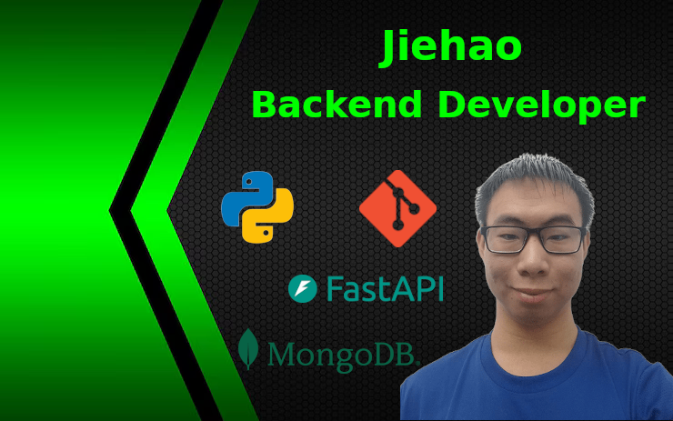
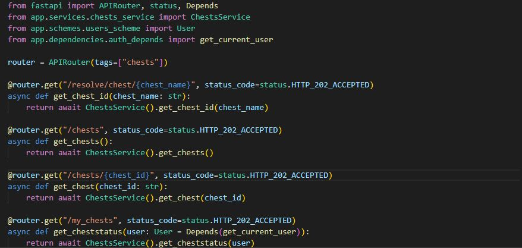
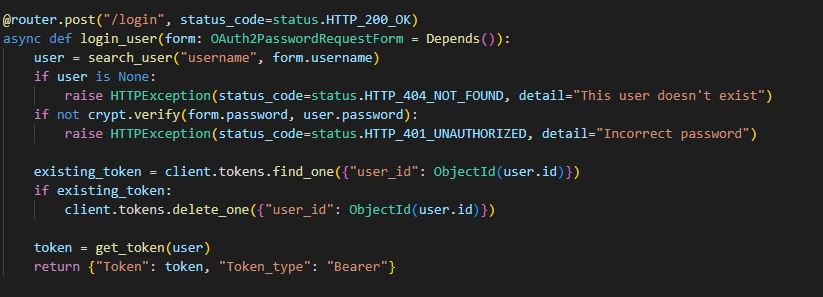

# __¡Hola!, mi nombre es Jiehao__

## __Backend Developer__

---

---

## __Sobre mí__

Soy un desarrollador backend, apasionado por escribir código fuente bien estructurado y con propósito. No busco la perfección, pero sí que el código funcione y deje claro por qué y para qué fue escrito.

Me metí en el mundo de la programación gracias a la base que adquirí en un grado medio de Sistemas Microinformáticos y Redes (SMR).

Ese primer contacto con los fundamentos quise aprender muchas cosas por mi cuenta, impulsado por mi curiosidad y el deseo constante de entender mejor el mundo de la programación.

##  __Tecnologías__
---

---

## __Proyectos__

### __1. BACKEND API POKEMON__

* [__Ver proyecto__](https://github.com/Jiehao530/project_pokemon)

---

### __2. BACKEND API FOR THE MARKETPLACE__

* [__Ver proyecto__](https://github.com/Jiehao530/project_marketplace)

---

### __3. BACKEND API FOR USER AND PRODUCT MANAGEMENT__

* [__Ver proyecto__](https://github.com/Jiehao530/project)

---
### __4. BACKEND FOR SECURE CHAT WITH USER AUTHENTICATION AND AI-DRIVEN MESSAGING__

* [__Ver proyecto__](https://github.com/Jiehao530/project_socket)

---
## __Contacto__

